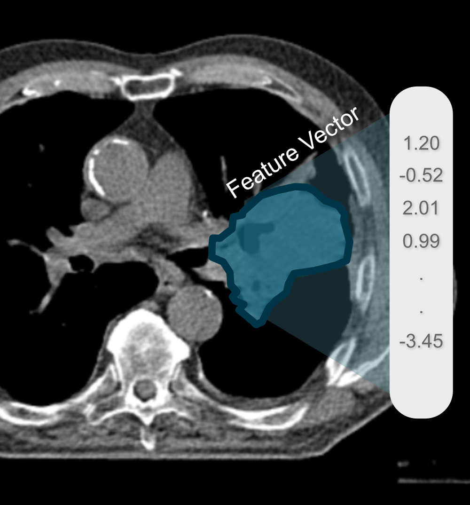
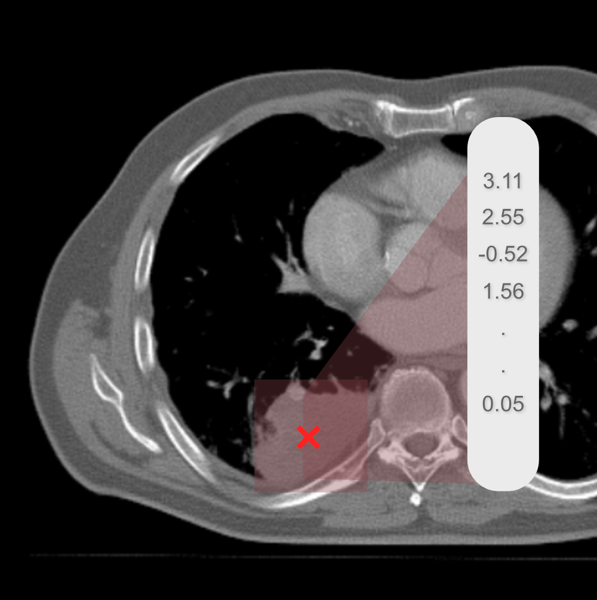
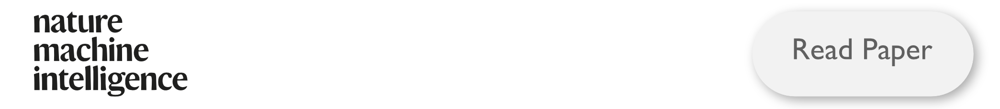

This is the official repository for the paper
  

    
    

        
        
    

    

  

---
**NOTE:**
 For detailed documentation check our [website](https://aim-harvard.github.io/foundation-cancer-image-biomarker/) 

---

