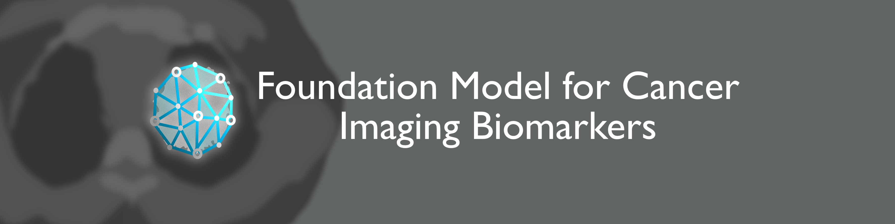
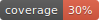
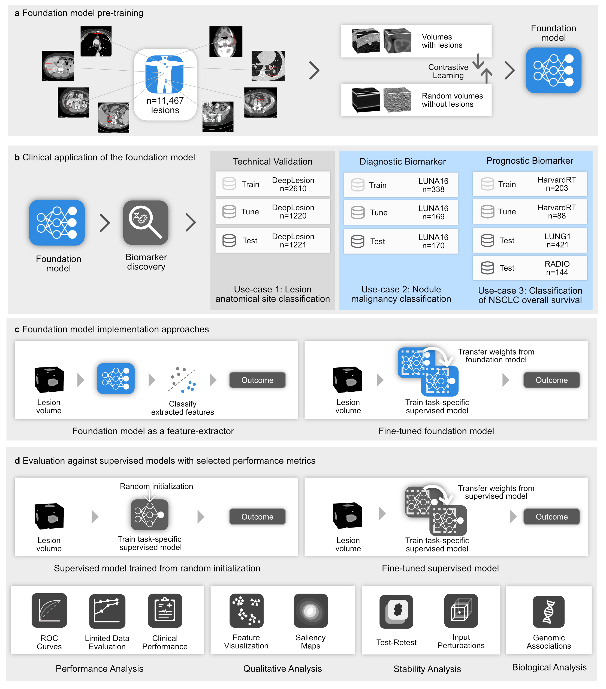

<div style="display: flex; justify-content: center">
</div>
<br/><br/>
<div align="center">

[](https://github.com/AIM-Harvard/foundation-cancer-image-biomarker/actions/workflows/build.yml)
[](https://pypi.org/project/foundation-cancer-image-biomarker/)
[](https://github.com/AIM-Harvard/foundation-cancer-image-biomarker/pulls?utf8=%E2%9C%93&q=is%3Apr%20author%3Aapp%2Fdependabot)
[](https://github.com/psf/black)
[](https://github.com/PyCQA/bandit)
[](https://github.com/AIM-Harvard/foundation-cancer-image-biomarker/blob/master/.pre-commit-config.yaml)
[](https://github.com/AIM-Harvard/foundation-cancer-image-biomarker/releases)
[](https://github.com/AIM-Harvard/foundation-cancer-image-biomarker/blob/master/LICENSE)
[](https://github.com/AIM-Harvard/foundation-cancer-image-biomarker/blob/master/docs/assets/images/coverage.svg)

</div>


This is the the official repository for the paper:<br>
 "<i>Foundation Models for Quantitative Biomarker Discovery in Cancer Imaging </i>" <br>
Suraj Pai, Dennis Bontempi, Vasco Prudente, Ibrahim Hadzic, Mateo Sokač, Tafadzwa L. Chaunzwa, Simon Bernatz, Ahmed Hosny, Raymond H Mak, Nicolai J Birkbak, Hugo JWL Aerts


---
**NOTE**
 For detailed documentation check our [website](https://aim-harvard.github.io/foundation-cancer-image-biomarker/) 

---

&emsp;
## Overview

<div style="display: flex; justify-content: center"></div>
A foundation model, based on a deep convolutional encoder architecture, was pre-trained by contrasting volumes with and without lesions (see <b>a.</b> in Figure). The foundation model was then used to extract biomarkers and evaluated for three classification tasks on diverse datasets. (see <b>b.</b>). We adapted foundation model to specific use cases by extracting features or through fine-tuning (see <b>c.</b>). Performance of the foundation models was compared against conventional supervised implementations, trained from scratch (left) and fine-tuned from a different task (right) (in <b>d</b>). The comparison was made through several criteria for different use cases, including quantitative performance, stability, and biological analysis. Biological, clinical, and stability analyses are limited to use case 2 due to the availability of associated data. 
 
&emsp;


&emsp;

## Quick Start (in under 15 mins!)
We provide two notebooks that can be run in google colab to promote the use of our model by the community,

1. A reproducibility notebook that allows users to recreate our analysis for NSCLC prognostication, from downloading the data to obtaining results matching our manuscript. <br><center>
[](https://colab.research.google.com/drive/1Svk8VaZHWAYdZHE45DNdWXVqhe7v9sFR?usp=sharing) </center>

2. A bring your own use case notebook that shows you how you can use the foundation model for your data. <br> <center>
[](https://colab.research.google.com/drive/1JMtj_4W0uNPzrVnM9EpN1_xpaB-5KC1H?usp=sharing) </center>


<b>You are not limited to using Colab and you can run our model on your data locally in only 3 steps!</b>

<u>Step 1:</u> Install all our dependencies:
```bash
pip install foundation-cancer-image-biomarker --pre
```

<u>Step 2:</u>  Generate a CSV file with the path to your images and seed points (in physical coordinates),

| **image_path**               | **coordX** | **coordY** | **coordZ** |
|------------------------------|------------|------------|------------|
| /content/data/dummy_0.nii.gz | 55.0       | 119.0      | 27.0       |

<u>Step 3:</u>  Run this in your code environment,
```python
from fmcib.run import get_features

feature_df = get_features("csv_path_here")
```

This will preprocess your data, download our pre-trained model and execute inference on whatever device you have (CPU/GPU) and return a dataframe with the features.


 
&emsp;
## License
This project is licensed under the terms of the `MIT` license.
 See [LICENSE](https://github.com/AIM-Harvard/foundation-cancer-image-biomarker/blob/master/LICENSE) for more details.

&emsp;
## Acknowledgements
Code development, testing, and documentation: [Suraj Pai](), [Ibrahim Hadzic]() <br>
Framework used for building the code: [project-lighter](https://github.com/project-lighter/lighter)

project-lighter was developed internally within our lab by Ibrahim Hadzic and Suraj Pai. 

&emsp;
## Disclaimer
The code and data of this repository are provided to promote reproducible research. They are not intended for clinical care or
commercial use. The software is provided "as is", without warranty of any kind, express or implied, including but not limited to the warranties of merchantability, fitness for a particular purpose and noninfringement. In no event shall the authors or copyright holders be liable for any claim, damages or other liability, whether in an action of contract, tort or otherwise, arising from, out of or in connection with the software or the use or other dealings in the software.

&emsp;
## Code Citation
Will be updated to reflect a Zenodo DOI upon publication
```bibtex
@misc{foundation-cancer-image-biomarker,
  author = {AIM-Harvard},
  title = {Official repo for "Foundation Models for Quantitative Biomarker Discovery in Cancer Imaging"},
  year = {2023},
  publisher = {GitHub},
  journal = {GitHub repository},
  howpublished = {\url{https://github.com/AIM-Harvard/foundation-cancer-image-biomarker}}
}
```