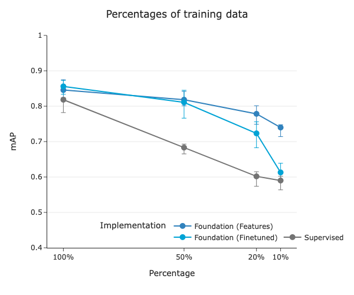

# Foundation Models for Quantitative Imaging Biomarker Discovery in Cancer Imaging

<!-- <div align="center">

[](https://github.com/foundation_image_biomarker/foundation-image-biomarker/actions?query=workflow%3Abuild)
[](https://pypi.org/project/foundation-image-biomarker/)
[](https://github.com/foundation_image_biomarker/foundation-image-biomarker/pulls?utf8=%E2%9C%93&q=is%3Apr%20author%3Aapp%2Fdependabot)

[](https://github.com/psf/black)
[](https://github.com/PyCQA/bandit)
[](https://github.com/foundation_image_biomarker/foundation-image-biomarker/blob/master/.pre-commit-config.yaml)
[](https://github.com/foundation_image_biomarker/foundation-image-biomarker/releases)
[](https://github.com/foundation_image_biomarker/foundation-image-biomarker/blob/master/LICENSE)


</div> -->

This is the the official repository for the paper <i> Foundation Models for Quantitative Biomarker Discovery for Cancer Imaging </i> <br/>
Suraj Pai, Dennis Bontempi, Vasco Prudente, Ibrahim Hadzic, Mateo Sokač, Tafadzwa L. Chaunzwa, Simon Bernatz, Ahmed Hosny, Raymond H Mak, Nicolai J Birkbak, Hugo JWL Aerts

&emsp;
## Overview
<div style="display: flex; justify-content: center"></div>

 <b>General overview of the study.</b><b> a. Foundation model pre-training.</b> A foundation model, specifically a deep convolutional encoder model, was pre-trained by contrasting volumes with and without lesions. <b> b.  Clinical application of the foundation model.</b> The foundation model was used to extract biomarkers and then evaluated for three classification tasks on diverse datasets. <b>c. Foundation model implementation approaches </b>  The foundation model was adapted to specific use cases by extracting features or through fine-tuning (left). <b> d. Evaluation against supervised models with selected performance metrics. </b> We compared the performance of the foundation models against conventional supervised implementations, trained from scratch (left) and fine-tuned from a different task (right). The comparison was made through several criteria for the different use cases, including quantitative performance, stability, and biological analysis. Biological, clinical, and stability analyses are limited to use case 2 due to the availability of associated data. 

&emsp;
## Table of Contents

- [Repository Structure](#repository-structure)
- [Quick Start](#quick-start)
- [Data](#data)
  - [Downloading the datasets](#downloading-the-datasets)
  - [Preprocessing the datasets](#preprocessing-the-datasets)
- [Model](#model)
  - [Accessing our models](#accessing-our-models)
    - [Self-supervised pre-training model](#self-supervised-pre-training-model)
    - [Supervised models](#supervised-models)
    - [Linear (Logistic Regression) models](#linear-logistic-regression-models)


  - [Reproduce our models](#reproduce-our-models)
    - [Data setup for the models](#data-setup-for-the-models)
    - [Reproducing our foundation model](#reproducing-our-foundation-model)
    - [Reproducing our supervised training](#reproducing-our-supervised-training)
    - [Running predictions from our models](#running-predictions-from-our-models)
    - [Extracting features from our models](#extracting-features-from-our-models)
    - [Reproducing our linear evaluation](#reproducing-our-linear-evaluation-logistic-regression)

- [Outputs](#outputs)
  - [Feature extaction pipeline](#feature-extaction-pipeline)
  - [Predictions pipeline](#predictions-pipeline)
- [Analysis](#analysis)
- [License](#🛡-license)
- [Acknowledgement](#acknowledgements)
- [Disclaimer](#disclaimer)
- [Code Citation](#📃-code-citation)

<div style="page-break-after: always;"></div>

## Repository Structure

This code repository includes the Python package containing all our source code: `fmcib`, as well as the code to reproduce experiments and analyses presented in our paper. The pipelines to reproduce our experiments and analyses are independent of the python package and will be shared to the public upon publication.

Here is the structure of the repository:

```
├── fmcib/          # The main Python package
├── data/           # Downloading and preprocessing data
├── experiments/    # Reproduce paper experiments
├── models/         # Download and test final models
├── outputs/        # Outputs from pipelines in the study
├── analysis/       # Reproducible analysis for statistics
├── additional_requirements.txt
└── README.pdf
```

&emsp;
## Quick Start

We recommend using **Python 3.8** on a Linux machine since that is the environment we have tested on. However, the use of Poetry for managing dependencies should make it compatible with Python versions above 3.8 on all platforms. We suggest using Conda to create an isolated virtual environment for the project dependencies. To download Conda, follow the instructions here: https://conda.io/projects/conda/en/latest/user-guide/install/index.html

After downloading and activating Conda, create and activate a virtual environment with the following commands:

```python
conda create -n fmcib_env python=3.8
conda activate fmcib_env
```

The most straightforward way to use this repository is by installing our publicly available `pip` package, which includes the majority of dependencies needed for reproducing the experiments and lets you load model weights dynamically.

Download our latest pre-release version with the following command:

```bash
pip install foundation-cancer-image-biomarker --pre
```

If you'd like to download and process the data from scratch, install the additional required dependencies using:

```bash
pip install -r additional_requirements.txt
```

You can verify if the dependencies are installed by: 
```bash
python -c "import fmcib; print(fmcib.__version__)"
```


<div style="page-break-after: always;"></div>

## Data
The majority of the datasets utilized in this study are openly accessible for both training and validation purposes: 
1.  DeepLesion (https://nihcc.app.box.com/v/DeepLesion/): DeepLesion is a dataset comprising 32,735 lesions from 10,594 studies of 4,427 unique patients collected over two decades from the National Institute of Health Clinical Center PACS server. Various lesions, including kidney, bone, and liver lesions - as well as enlarged lymph nodes and lung nodules, are annotated. The lesions are identified through radiologist-bookmarked RECIST diameters across 32,120 CT slice . In our study we use this dataset both for our pre-training and use-case 1 


2.  LUNA16 (https://luna16.grand-challenge.org/Data/): LUNA16 is a curated version of the LIDC-IDRI dataset of 888 diagnostic and lung cancer screening thoracic CT scans obtained from seven academic centers and eight medical imaging companies comprising 1,186 nodules. The nodules are accompanied by annotations agreed upon by at least 3 out of 4 radiologists. Alongside nodule location annotations, radiologists also noted various observed attributes like internal composition, calcification, malignancy, suspiciousness, and more. We use this dataset to develop and validate our diagnostic image biomarker


3. LUNG1 (https://wiki.cancerimagingarchive.net/display/Public/NSCLC-Radiomics): LUNG1 is a cohort of 422 patients with stage I-IIIB NSCLC treated with radiation therapy at MAASTRO Clinic, Maastricht, The Netherlands. FDG PET-CT scans were acquired with or without contrast on the Siemens Biograph Scanner. Radiation oncologists used PET and CT images to delineate the gross tumor volume. Our prognostic image biomarker is validated using this cohort. 


4. RADIO (https://wiki.cancerimagingarchive.net/display/Public/NSCLC+Radiogenomics): RADIO (NSCLC-Radiogenomics) 
dataset is a collection of 211 NSCLC stage I-IV patients who were referred for surgical treatment and underwent preoperative CT and PET/CT scans. These patients were recruited from the Stanford University School of Medicine and the Palo Alto Veterans Affairs Healthcare System. Scan scans were obtained using various scanners and protocols depending on the institution and physician. A subset of 144 patients in the cohort has available tumor segmentations independently reviewed by two thoracic radiologists. In addition to imaging data, the dataset includes molecular data from EGFR, KRAS, ALK mutational testing, gene expression microarrays, and RNA sequencing. We use this dataset for validation the performance of our prognostic biomarker and also for our biological analysis.

Note: The training dataset for our prognostic biomarker model, HarvardRT, is internal and unavailable to the public. Nonetheless, our foundational model can be publicly accessed, and the results reproduced using the accessible test datasets. 

Along with this codebase, we provide scripts and code to easily download and pre-process this dataset to encourage reproduction of our study. This README contains detailed information on how to do so. 

### Downloading the datasets
The DeepLesion and LUNA16 dataset can be downloading using download scripts provided in `data/download`. Note that these scripts are provided for a linux environment but can be simply adapted to other environments by downloading equivalent packages. For the LUNG1 and RADIO datasets, we provide an end-to-end way to download and process them using the [Imaging Data Commons](https://datacommons.cancer.gov/repository/imaging-data-commons) infrastructure through Google Colab notebooks. This can also be run locally by downloading the google colab jupyter notebook and simply running it on your local machine.

<b> Downloading the DeepLesion and LUNA16 datasets </b>
Note: Conda is required to perform this. Make sure you have enough space in the location you are downloading (~250GB for DeepLesion, ~60GB for LUNA16)

For DeepLesion,
```
cd data/download
bash deeplesion.sh <path_to_download>
```

For LUNA16,
```
cd data/download
bash luna16.sh <path_to_download>
```
<b> Downloading the LUNG1 and RADIO datasets </b>
Refer to [Google colab notebook](https://colab.research.google.com/drive/1Svk8VaZHWAYdZHE45DNdWXVqhe7v9sFR#scrollTo=okx0n73EI11u) that contains information on how this data can be downloaded and pre-processed.

### Preprocessing the datasets
We provide simple linux shell scripts to reproduce the pre-processing pipeline. Incase, you have a different operating system, simply run the python scripts in these shell scripts individually in your environment.

<b> Pre-processing the DeepLesion dataset </b>
Note: Conda is required to perform this
```
cd data/preprocessing/deeplesion
bash run.sh <path_to_download>
```

Once you run this successfully, you should see a file `data/processing/deeplesion/annotations/deeplesion_training_annotations.csv`. At this point you can run the notebook `data/processing/deeplesion/Process_Dataset.ipynb` to get the splits we use in our paper. For reference, we have already provided splits for comparison as generated by us.

NOTE: The pre-processing extracts the image files from zip files. Please delete the zip files from the path `<path_to_download>/DeepLesion/Images_png` using `rm <path_to_download>/DeepLesion/Images_png/*.zip`  path after these scripts are successfully run to not inflate your disk space.


<b> Pre-processing the LUNA16 dataset </b>
```
cd data/preprocessing/luna16
bash run.sh <path_to_download>
```

NOTE: The pre-processing extracts the image files from zip files. Please delete the zip files from the path `<path_to_download>/LUNA16` using `rm <path_to_download>/LUNA16/*.zip` after these scripts are successfully run to not inflate your disk space.

Once you run this successfully, you should see a file `data/processing/deeplesion/annotations/luna16_training_annotations.csv`. At this point you can run the notebook `data/processing/deeplesion/Process_Dataset.ipynb` to get the splits we use in our paper. For reference, we have already provided splits for comparison as generated by us.

<b> Pre-processing the LUNG1 and RADIO dataset </b>
Refer to [our Google Colab reproducible notebooks](https://colab.research.google.com/drive/1Svk8VaZHWAYdZHE45DNdWXVqhe7v9sFR#scrollTo=okx0n73EI11u) that also contains information on how this data can be accessed

<div style="page-break-after: always;"></div>

## Model


### Accessing our models
All our models are will be made available to the public through Zenodo upon publication. Currently, we release these using Dropbox for the reviewers to use and test. Scripts for downloading these models are present under `models`. 

As part of our study we develop and share the following,

### Self-supervised pre-training model:
We developed the pretrained model using the DeepLesion dataset with 11,467 annotated CT lesions identified from 2,312 unique patients. Lesion findings were diverse and included multiple lesions, such as lung nodules, cysts, and breast lesions, among numerous others. A task-agnostic contrastive learning strategy was used to pre-train the model on these lesion findings. Refer to the methods section for more information or the reproducing our models section.

To download these models run,
````bash
cd models
bash download_pretrained_models.sh
````

You can also extract the dropbox links and place them in the target location mentioned

<div style="display: flex; justify-content: center"></div>


The pre-trained model is implemented on downstreams task using supervised training or linear evaluation approaches. For these we develop,

### Supervised models:

We developed three supervised training approaches,
 - Supervised model trained from random initialization
<br>
<div style="display: flex; justify-content: center"></div>


 - Fine-tuning a trained supervised model
<br>
<div style="display: flex; justify-content: center"></div>

 - Fine-tuning a pre-trained foundation model
<br>
<div style="display: flex; justify-content: center"></div>


To download these models run,
````bash
cd models
bash download_supervised_models.sh
````


### Linear (Logistic Regression) models:
Our linear model takes features extracted from the pre-trained foundation model and builds a logistic regression classifer to predict outcome. 
<div style="display: flex; justify-content: center"></div>

&emsp;
To download these models run,
````bash
cd models
bash download_linear_models.sh
````

These models can also be found at this [link](https://www.dropbox.com/scl/fo/brhqokhzn839zez15erzf/h?dl=0&rlkey=wzvgrobl8p3v49ettm16uxbyy). In addition to providing our models, we also provide comprehensive documentation and ongoing support to users through [project-lighter](https://zenodo.org/record/8007711) to reproduce our results and workflows.

### Reproduce our models

### Data setup for the models
Make sure you download all the datasets before starting to train. The datasets are provided as CSV files to the training pipelines with `image_path` column providing location of the image to be used, `coordX`, `coordY` and `coordZ` providing the global coordinates of the seed point around which a patch is cropped. We crop a [50, 50, 50] patch around the seed point. Please refer to our paper for more details on this. Along with these columns, label columns are needed for supervised training. Labels for each task are as follows,
```
Task 1: Coarse_lesion_type
Task 2: malignancy
Task 3: survival
```


### Reproducing our foundation model
The crux of our study is the self-supervised training procedure. We implemented contrastive pre-training using a modified version of the SimCLR framework. The SimCLR framework's general principle involves transforming a single data piece (e.g., a patch taken from a CT scan) into two correlated and augmented samples (e.g., the same patch rotated 15 degrees clockwise and flipped horizontally). A convolutional encoder is then used to extract latent representations from these samples. Through a contrastive loss function, the model learns to identify similar representations from the same data sample and dissimilar representations from different data samples. The framework emphasizes effective transformation choices, convolutional encoder architectures, and contrastive loss functions for optimal self-supervised learning performance. To effectively represent the nature of medical images, we made modifications to each of these components. 

1. Medical image specific transformations implemented from Project-MONAI (https://monai.io/) and custom implementations at `fmcib.ssl.transforms`
2. 3D ResNet from Project-MONAI
3. Custom implemented modified loss function and SimCLR architecture that can be found under `fmcib.ssl.losses.NTXentNegativeMinedLoss` and `fmcib.ssl.models.ExNegSimCLR`

<b> Self-supervised pretraining </b>
We use project-lighter developed internally within our lab to provide reproducible training for all the models used in this study. Project-lighter allows a YAML-based configuration system along with a python-based CLI to allow quick, easy and scalable experimentation.

To pre-train on the DeepLesion pretraining set, you can find the YAML for the pre-training at `experiments/pretraining/simclr_pretrain.yaml`. It is assumed that you have a GPU available. If you do not (not recommended and not tested), then edit the following parameters
```yaml
  accelerator: cpu
  strategy: auto
  devices: 1
``` 

The default training assumes 2 GPUs as mentioned in the paper. You can change this by setting
```yaml
devices: 1
```

Change the path of the train dataset to the pre-train set generated earlier in the data-preprocessing step

```yaml
train_dataset:
  _target_: fmcib.ssl.datasets.SSLRadiomicsDataset
  path: "your_pretrain_set_path_goes_here"
```

Now you can start training by running this in the root code folder,


```bash
lighter fit --config_file ./experiments/pretraining/simclr_pretrain.yaml
```


### Reproducing our supervised training
As mentioned in [section](#supervised-models), we have three different supervised training implementations. Similar to the foundation pre-training, we use YAML files to maintain the configurations of these implementations. 

<b> Supervised model trained from random initialization </b>

In order to reproduce this training, you can inspect the YAML configuration at `experiments/supervised_training/supervised_random_init.yaml`. By default, we configure this for Task 1. You can adapt this for Task 2 and Task 3 by searching for 'Note: ' comments in the YAML that outline what must be changed.

You can start training by running this in the root code folder,
```bash
lighter fit --config_file ./experiments/supervised_training/supervised_random_init.yaml
```

<b> Fine-tuning a trained supervised model </b>

The YAML configuration at `experiments/supervised_training/supervised_finetune.yaml` describes how you can fine-tune an already trained supervised model. Note that this is possible only for Task 2 and Task 3 as we used the supervised model trained in Task 1 to load weights from. Make sure you download the weights for Task 1 supervised models. You can follow instructions [here](#model) 


You can start training by running this in the root code folder,
```bash
lighter fit --config_file ./experiments/supervised_training/supervised_finetune.yaml
```

<b> Fine-tuning a pre-trained foundation model </b>

We provide the YAML configuration for this at `experiments/supervised_training/foundation_finetune.yaml`. Similar to the random initialization supervised training, it has been configured for Task 1 with 'Note:' tags for modifying to other tasks. Make sure you download the weights for the pre-trained foundation model before attempting to reproduce this training. You can follow instructions [here](#model) 

You can start training by running this in the root code folder,
```bash
lighter fit --config_file ./experiments/supervised_training/foundation_finetune.yaml
```

### Running predictions from our models.

To run predictions from our models (both supervised and self-supervised), we provide YAML files that can be run with the lighter interface. These are found in `experiments`, namely `get_predictions.yaml` for getting the predictions. 

These can be run using

```bash
lighter predict --config_file ./experiments/get_predictions.yaml
```
As with the previous YAMLS, please follow the 'Note:' tags to place appropriate data paths and change relevant parameters. This YAML is to be used if you want to get target predictions from the models.

### Extracting features from our models.

In order to extract features from our models, you can use the following,
```bash
lighter predict --config_file ./experiments/extract_features.yaml
```


<b>IMPORTANT:</b> While the above pipeline will allow you to extract features, we provide an easier and simpler way to do this through Google Colab. To promote accessibility to our work, we have simplified the feature extraction process and provide the notebook [here](https://colab.research.google.com/drive/1JMtj_4W0uNPzrVnM9EpN1_xpaB-5KC1H?usp=sharing)


### Reproducing our linear evaluation (Logistic Regression)
We extracted 4096 features from the foundation model for each data point and used them to train a logistic regression model using the scikit-learn framework. A comprehensive parameter search for the logistic regression model was performed using the optuna hyper-parameter optimization framework. The code and utilities for performing the logistic regression modelling is provided in `experiments/linear_evaluation`

In order to perform the modelling, you can run 
```bash
python run.py <features_folder> <label>
```

The <features_folder> must contain `train_features.csv`, `val_features.csv` and `test_features.csv` all extracted from our foundation model. The process to extract features from our foundation model is highlighted in this [section](#running-predictions-and-extracting-features-from-our-models)

The <label> corresponds to the column in the csv files that contains the supervised label to predict. For example, in use-case 2 the label is `malignancy`. 

You can also provide scoring metrics, for instance,  using `--scoring roc_auc` where the scoring metric is a sklearn scorer. You can also provide the number of trials the optimization framework needs to be run for using `--trials`. 

The features folder is provided under `outputs/foundation_features` to try our the modelling process. Refer [here](#feature-extaction-pipeline)

<div style="page-break-after: always;"></div>

## Outputs
The `outputs` folder contains outputs from several pipelines used in our study. To download all the outputs, you can run


```bash
cd outputs
bash download_outputs.sh
```


The script contains several dropbox links. You can also manually download them and place them in the right location. 

### Feature extaction pipeline
The `foundation_features` folders contains features extracted from the pre-trained foundation model for Task 1, 2 and 3. The features are stored in `csv` files with column names `feature_x` corresponding to the dimension `x` of the feature. The total dimensionality of the features is 4096. Below is the structure of the folder,
```bash
outputs
└── foundation_features
    └── task1
        └── *.csv
    └── task2
        └── *.csv
    └── task3
        └── *.csv
```

For Task 1 and 2, `train_features.csv`, `val_features.csv` and `test_features.csv` correspond to features extracted from train, val and test splits. 

For task 3, `lung1.csv` and `radio.csv` correspond to features extracted from LUNG1 and RADIO testing datasets. 
The process to extract these features are also documented in this README and can be accessed [here](#running-predictions-and-extracting-features-from-our-models)


### Predictions pipeline
In the `predictions` folder, we store the predictions generated by each of the various implementation approaches used in our study. The different implementation approaches used to apply our foundation model to the three downstream tasks are described in this [section](#model). The structure of the outputs folder is as below,
```bash
outputs
└── predictions
    └── task1
        └── *.csv
    └── task2
        └── *.csv
    └── task3
        └── HarvardRT
            └── *.csv 
        └── LUNG1
            └── *.csv 
        └── RADIO
            └── *.csv 
```
For Task 1 and Task 2, we store predictions extracted over a range of different percentages of data used during the model training process (100%, 50%, 20%, and 10%). Predictions are saved for each of the implementation approaches. To differentiate between the predictions based on limited data percentages, we have appended a suffix `_x_percent.cs`, where 'x' represents the data percentage used

For Task 3, we provide predictions for each of the different implementation approaches when tested on the LUNG1 and RADIO datasets. Validation predictions of the HarvardRT for computing Kaplan Meier curves as presented in [analysis](#analysis) notebooks are also provided.

<div style="page-break-after: always;"></div>

## Analysis
To support complete transparency of our work and allow you to have a better understanding of our analysis pipelines, the provided notebooks, with detailed walk-throughs, will help explore our analysis as well as reproduce the figures that are included in our research paper. The predictions extracted are described [here](#predictions-extracted).

The analysis notebooks are organized as follows,

```bash
analysis
└── task1.ipynb
└── task2.ipynb
└── task3.ipynb
└── stability.ipynb
```

Detailed walk-throughs are provided in the notebooks. These notebooks reproduce Figures 2, 3, 4 and Extended Data Figure 3. Please ensure you download additional dependenices as described in the [quickstart](#quick-start) and that you have downloaded all the outputs from our pipelines.

Shown below are samples from the analysis notebooks
<div style="display: flex; justify-content: center"></div>

<div style="display: flex; justify-content: center"></div>

<div style="page-break-after: always;"></div>

&emsp;
## License

This project is licensed under the terms of the `MIT` license. See [LICENSE](https://github.com/AIM-Harvard/foundation-cancer-image-biomarker/blob/master/LICENSE) for more details.

&emsp;
## Acknowledgements
Code development, testing, and documentation: Suraj Pai
Framework used for building the code: project-lighter (https://github.com/project-lighter/lighter)

project-lighter was developed internally within our lab by Ibrahim Hadzic and Suraj Pai. 

&emsp;
## Disclaimer
The code and data of this repository are provided to promote reproducible research. They are not intended for clinical care or
commercial use. The software is provided "as is", without warranty of any kind, express or implied, including but not limited to the warranties of merchantability, fitness for a particular purpose and noninfringement. In no event shall the authors or copyright holders be liable for any claim, damages or other liability, whether in an action of contract, tort or otherwise, arising from, out of or in connection with the software or the use or other dealings in the software.

&emsp;
## Code Citation
Will be updated to reflect a Zenodo DOI upon publication
```bibtex
@misc{foundation-cancer-image-biomarker,
  author = {AIM-Harvard},
  title = {Official repo for "Foundation Models for Quantitative Biomarker Discovery in Cancer Imaging"},
  year = {2023},
  publisher = {GitHub},
  journal = {GitHub repository},
  howpublished = {\url{https://github.com/AIM-Harvard/foundation-cancer-image-biomarker}}
}
```
