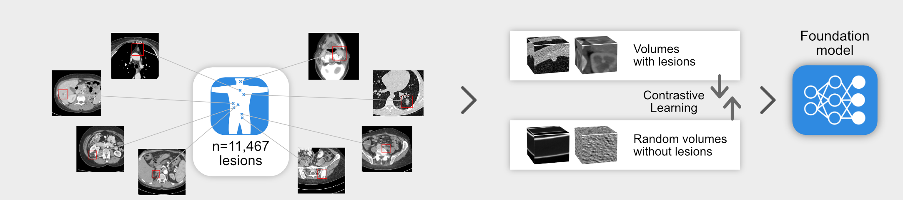
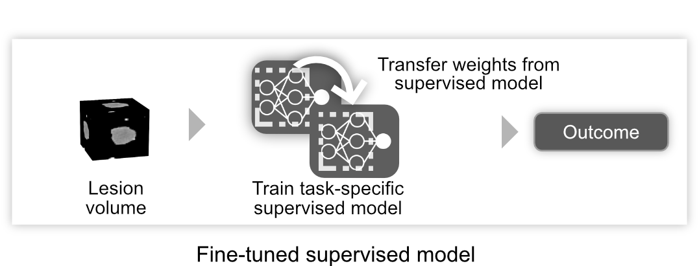
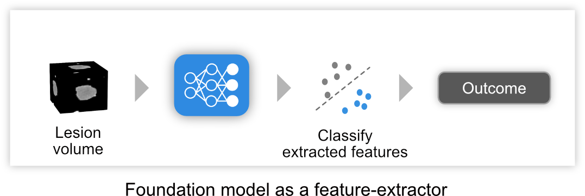

# Model


## Downloading our models
All our models are will be made available to the public through Zenodo upon publication. Currently, we release these using Dropbox for the reviewers to use and test. Scripts for downloading these models are present under `models`. 

As part of our study we develop and share the following,

### Self-supervised pre-training model
We developed the pretrained model using the DeepLesion dataset with 11,467 annotated CT lesions identified from 2,312 unique patients. Lesion findings were diverse and included multiple lesions, such as lung nodules, cysts, and breast lesions, among numerous others. A task-agnostic contrastive learning strategy was used to pre-train the model on these lesion findings. Refer to the methods section for more information or the reproducing our models section.

To download these models run,
````bash
cd models
bash download_pretrained_models.sh
````

You can also extract the dropbox links and place them in the target location mentioned.


<div style="display: flex; justify-content: center"></div>


The pre-trained model is implemented on downstreams task using supervised training or linear evaluation approaches. For these we develop,

### Supervised models

We developed three supervised training approaches,

 - Supervised model trained from random initialization
<br>
<div style="display: flex; justify-content: center"></div>


 - Fine-tuning a trained supervised model
<br>
<div style="display: flex; justify-content: center"></div>

 - Fine-tuning a pre-trained foundation model
<br>
<div style="display: flex; justify-content: center"></div>


To download these models run,
````bash
cd models
bash download_supervised_models.sh
````


### Linear (Logistic Regression) models
Our linear model takes features extracted from the pre-trained foundation model and builds a logistic regression classifer to predict outcome. 
<div style="display: flex; justify-content: center"></div>

&emsp;
To download these models run,
````bash
cd models
bash download_linear_models.sh
````

These models can also be found at this [link](https://www.dropbox.com/scl/fo/brhqokhzn839zez15erzf/h?dl=0&rlkey=wzvgrobl8p3v49ettm16uxbyy). In addition to providing our models, we also provide comprehensive documentation and ongoing support to users through [project-lighter](https://zenodo.org/record/8007711) to reproduce our results and workflows.

## Reproduce our models

### Data setup for the models
Make sure you download all the datasets before starting to train. The datasets are provided as CSV files to the training pipelines with `image_path` column providing location of the image to be used, `coordX`, `coordY` and `coordZ` providing the global coordinates of the seed point around which a patch is cropped. We crop a [50, 50, 50] patch around the seed point. Please refer to our paper for more details on this. Along with these columns, label columns are needed for supervised training. Labels for each task are as follows,
```
Task 1: Coarse_lesion_type
Task 2: malignancy
Task 3: survival
```


### Reproducing our foundation model
The crux of our study is the self-supervised training procedure. We implemented contrastive pre-training using a modified version of the SimCLR framework. The SimCLR framework's general principle involves transforming a single data piece (e.g., a patch taken from a CT scan) into two correlated and augmented samples (e.g., the same patch rotated 15 degrees clockwise and flipped horizontally). A convolutional encoder is then used to extract latent representations from these samples. Through a contrastive loss function, the model learns to identify similar representations from the same data sample and dissimilar representations from different data samples. The framework emphasizes effective transformation choices, convolutional encoder architectures, and contrastive loss functions for optimal self-supervised learning performance. To effectively represent the nature of medical images, we made modifications to each of these components. 

1. Medical image specific transformations implemented from Project-MONAI (https://monai.io/) and custom implementations at `fmcib.ssl.transforms`
2. 3D ResNet from Project-MONAI
3. Custom implemented modified loss function and SimCLR architecture that can be found under `fmcib.ssl.losses.NTXentNegativeMinedLoss` and `fmcib.ssl.models.ExNegSimCLR`

<b> Self-supervised pretraining </b>
We use project-lighter developed internally within our lab to provide reproducible training for all the models used in this study. Project-lighter allows a YAML-based configuration system along with a python-based CLI to allow quick, easy and scalable experimentation.

To pre-train on the DeepLesion pretraining set, you can find the YAML for the pre-training at `experiments/pretraining/simclr_pretrain.yaml`. It is assumed that you have a GPU available. If you do not (not recommended and not tested), then edit the following parameters
```yaml
  accelerator: cpu
  strategy: auto
  devices: 1
``` 

The default training assumes 2 GPUs as mentioned in the paper. You can change this by setting
```yaml
devices: 1
```

Change the path of the train dataset to the pre-train set generated earlier in the data-preprocessing step

```yaml
train_dataset:
  _target_: fmcib.ssl.datasets.SSLRadiomicsDataset
  path: "your_pretrain_set_path_goes_here"
```

Now you can start training by running this in the root code folder,


```bash
lighter fit --config_file ./experiments/pretraining/simclr_pretrain.yaml
```


### Reproducing our supervised training
As mentioned in [section](#supervised-models), we have three different supervised training implementations. Similar to the foundation pre-training, we use YAML files to maintain the configurations of these implementations. 

<b> Supervised model trained from random initialization </b>

In order to reproduce this training, you can inspect the YAML configuration at `experiments/supervised_training/supervised_random_init.yaml`. By default, we configure this for Task 1. You can adapt this for Task 2 and Task 3 by searching for 'Note: ' comments in the YAML that outline what must be changed.

You can start training by running this in the root code folder,
```bash
lighter fit --config_file ./experiments/supervised_training/supervised_random_init.yaml
```

<b> Fine-tuning a trained supervised model </b>

The YAML configuration at `experiments/supervised_training/supervised_finetune.yaml` describes how you can fine-tune an already trained supervised model. Note that this is possible only for Task 2 and Task 3 as we used the supervised model trained in Task 1 to load weights from. Make sure you download the weights for Task 1 supervised models. You can follow instructions [here](#model) 


You can start training by running this in the root code folder,
```bash
lighter fit --config_file ./experiments/supervised_training/supervised_finetune.yaml
```

<b> Fine-tuning a pre-trained foundation model </b>

We provide the YAML configuration for this at `experiments/supervised_training/foundation_finetune.yaml`. Similar to the random initialization supervised training, it has been configured for Task 1 with 'Note:' tags for modifying to other tasks. Make sure you download the weights for the pre-trained foundation model before attempting to reproduce this training. You can follow instructions [here](#model) 

You can start training by running this in the root code folder,
```bash
lighter fit --config_file ./experiments/supervised_training/foundation_finetune.yaml
```


### Reproducing our linear evaluation (Logistic Regression)
We extracted 4096 features from the foundation model for each data point and used them to train a logistic regression model using the scikit-learn framework. A comprehensive parameter search for the logistic regression model was performed using the optuna hyper-parameter optimization framework. The code and utilities for performing the logistic regression modelling is provided in `experiments/linear_evaluation`

In order to perform the modelling, you can run 
```bash
python run.py <features_folder> <label>
```

The <features_folder> must contain `train_features.csv`, `val_features.csv` and `test_features.csv` all extracted from our foundation model. The process to extract features from our foundation model is highlighted in this [section](#running-predictions-and-extracting-features-from-our-models)

The <label> corresponds to the column in the csv files that contains the supervised label to predict. For example, in use-case 2 the label is `malignancy`. 

You can also provide scoring metrics, for instance,  using `--scoring roc_auc` where the scoring metric is a sklearn scorer. You can also provide the number of trials the optimization framework needs to be run for using `--trials`. 

The features folder is provided under `outputs/foundation_features` to try our the modelling process. Refer [here](#feature-extaction-pipeline)